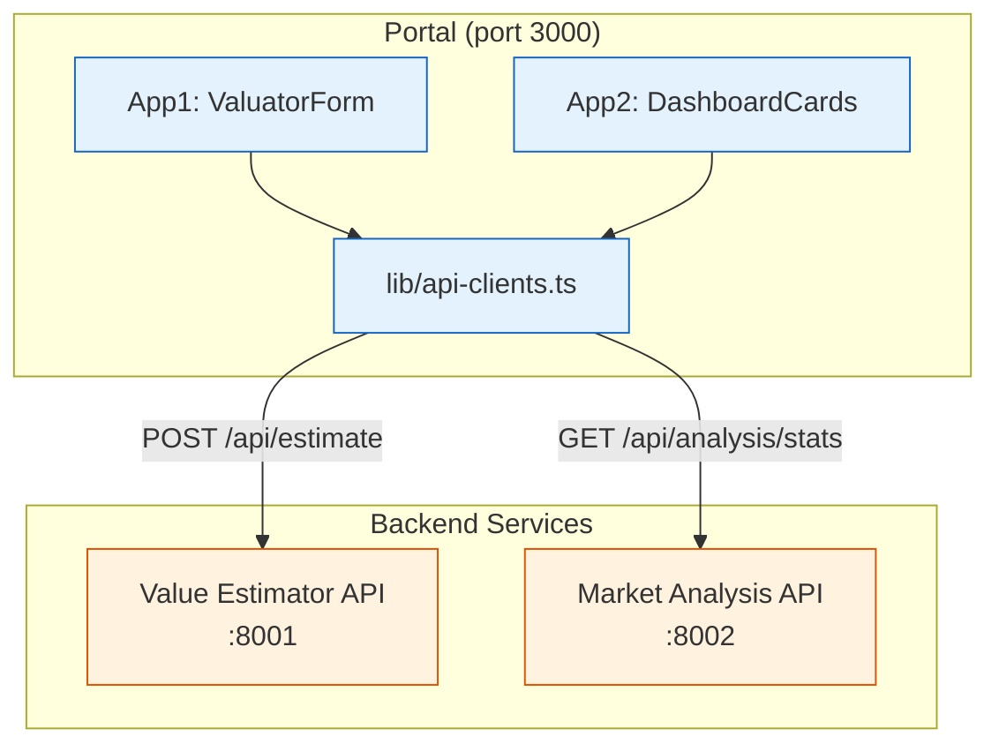

# Portal Framework — Integration Guide for EPIC-03 & EPIC-04

> **Status:** active | **Last updated:** 2026-06-15

This guide explains how downstream Epics (EPIC-03 Property Value Estimator, EPIC-04 Property Market Analysis) replace mock frontend data with real backend API calls while keeping the Portal framework unchanged.

---

## 1. Mock Data → Real API Mapping

### EPIC-03: Simple Valuator → Property Value Estimator

| Mock | Real API | File to Change |
|------|----------|----------------|
| `sqft * 150 + bedrooms * 10000` (inline calculation) | `POST /api/estimate` → `value-estimator-api:8001` | `components/app1/ValuatorForm.tsx` |
| No API client exists | Create `lib/api-clients.ts` | NEW FILE |

**Migration for ValuatorForm:**

```tsx
// BEFORE (mock):
const result = sqft * 150 + bedrooms * 10000;
setPrice(result);

// AFTER (real API):
const response = await fetch('http://value-estimator-api:8001/api/estimate', {
  method: 'POST',
  headers: { 'Content-Type': 'application/json' },
  body: JSON.stringify({ square_footage: sqft, bedrooms }),
});
const data = await response.json();
setPrice(data.predicted_price);
```

### EPIC-04: Market Overview → Property Market Analysis

| Mock | Real API | File to Change |
|------|----------|----------------|
| `getStats(region)` with simulated 500ms delay | `GET /api/analysis/stats?region=Downtown` → `market-analysis-api:8002` | `components/app2/DashboardCards.tsx` |
| `mock-data.ts` (static datasets) | Delete — replaced by real API | `components/app2/mock-data.ts` (DELETE) |

**Migration for DashboardCards:**

```tsx
// BEFORE (mock):
import { getStats } from './mock-data';
const data = await getStats(region);

// AFTER (real API):
const response = await fetch(`http://market-analysis-api:8002/api/analysis/stats?region=${region}`);
const data = await response.json();
```

**Expected API response shape:**

```json
{
  "region": "Downtown",
  "avgPrice": 520000,
  "totalListings": 12,
  "avgSqft": 1350
}
```

---

## 2. Files That MUST NOT Be Modified

These files are framework code. EPIC-03 and EPIC-04 should NOT touch them. If you need to change something in these files, contact the framework maintainer.

| File | Rationale |
|------|-----------|
| `app/(portal)/layout.tsx` | Shared portal layout with NavBar — does not depend on any app |
| `app/(portal)/app1/error.tsx` | Error boundary is app-generic |
| `app/(portal)/app2/error.tsx` | Error boundary is app-generic |
| `app/(portal)/app2/loading.tsx` | Skeleton works regardless of data source |
| `app/(portal)/page.tsx` | Landing page is static, no app logic |
| `components/app2/RegionFilter.tsx` | Pure UI, no data dependency |
| `packages/shared-ui/*` | Design system is data-agnostic |

**Exception handling**: If the real API returns a different shape than the mock data, create a data transformation function in `lib/` — do not modify the shared UI components to fit the API.

---

## 3. Recommended Directory for API Clients

Create a single file for all HTTP clients to keep API calls organized:

```
services/nextjs-portal/lib/
├── api-clients.ts      ← NEW: HTTP client functions for all backend services
└── constants.ts        ← Existing: nav items, default region, etc.
```

**Template for api-clients.ts:**

```ts
const ESTIMATOR_URL = process.env.NEXT_PUBLIC_ESTIMATOR_URL ?? 'http://localhost:8001';
const ANALYSIS_URL = process.env.NEXT_PUBLIC_ANALYSIS_URL ?? 'http://localhost:8002';

export async function estimatePrice(sqft: number, bedrooms: number) {
  const res = await fetch(`${ESTIMATOR_URL}/api/estimate`, {
    method: 'POST',
    headers: { 'Content-Type': 'application/json' },
    body: JSON.stringify({ square_footage: sqft, bedrooms }),
  });
  if (!res.ok) throw new Error(`Estimate API error: ${res.status}`);
  return res.json();
}

export async function getMarketStats(region: string) {
  const res = await fetch(`${ANALYSIS_URL}/api/analysis/stats?region=${encodeURIComponent(region)}`);
  if (!res.ok) throw new Error(`Analysis API error: ${res.status}`);
  return res.json();
}
```

---

## 4. EPIC-03 Checklist

- [ ] `components/app1/ValuatorForm.tsx`: Replace `calculate()` with `estimatePrice()` call
- [ ] `components/app1/PriceDisplay.tsx`: No change needed (display logic is decoupled)
- [ ] `lib/api-clients.ts`: Created with `estimatePrice()` function
- [ ] Error handling: Show error message via existing state when API returns error
- [ ] Loading state: ValuatorForm already shows "Predict" button — disable button during API call
- [ ] Update unit tests in `__tests__/ValuatorForm.test.tsx` to mock fetch

## 5. EPIC-04 Checklist

- [ ] `components/app2/mock-data.ts`: Deleted
- [ ] `components/app2/DashboardCards.tsx`: Replace `getStats()` with `getMarketStats()` call
- [ ] `lib/api-clients.ts`: Update with `getMarketStats()` function
- [ ] Error handling: `DashboardCards` should catch API errors and show `ErrorDisplay`
- [ ] Loading state: Already handled — `loading` state + `Skeleton` components are in place
- [ ] Update unit tests in `__tests__/DashboardCards.test.tsx`
- [ ] Update E2E test in `e2e/portal-flow.spec.ts` if needed

---

## 6. Architecture Diagram


